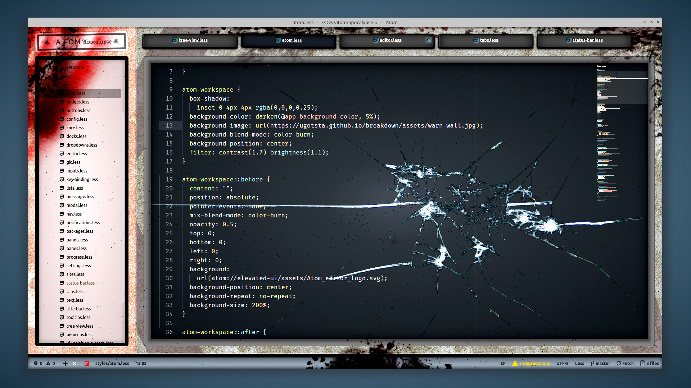
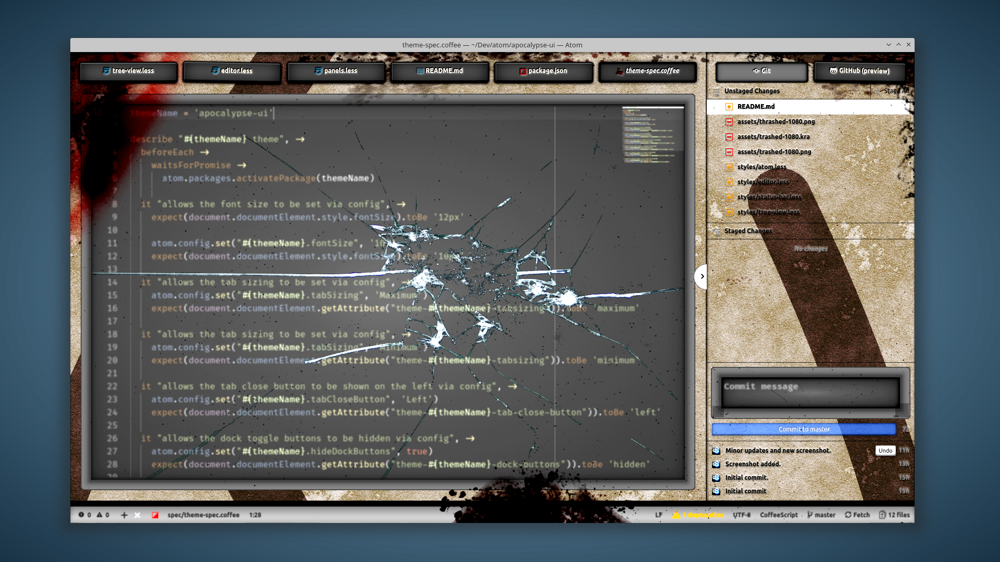
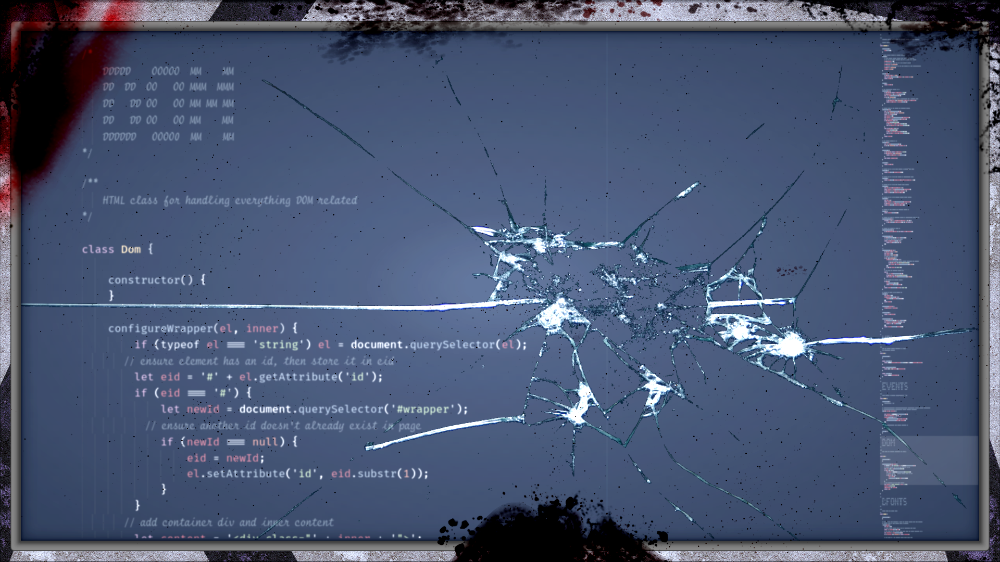

# Apocalypse UI

While madness overtook the world, ATOM sat idly awaiting the opportunity to again serve its human user's needs. That opportunity never came.

Many angry organic forms found their way to the lonely computer only to express the insanity of their disease. Some thrashed body parts at it. Others decorated the previously pristine terminal with lower lifeforms. One managed to crack its main display.

Once a pristine terminal, ATOM nows sits adorned with unrecognizable shreds of former life awaiting the impending darkness.

## Enter the Apocalypse

Apocalypse UI lets you code like all life once depended on it.

This is not a game.

> CSS with [MsMeeves Ice Cream Candy](https://atom.io/themes/msmeeves-ice-cream-candy-syntax) theme.

> CoffeeScript with [Alpenglow](https://atom.io/themes/alpenglow-atom-syntax) theme.

> Full-screen JavaScript with [Base 16 Ocean Dark](https://atom.io/packages/base16-ocean-dark-syntax-theme) theme.

> Font used in screenshots is [Fira Code iScript](https://github.com/kencrocken/FiraCodeiScript)

## Credits

* [@Atom One Dark UI](https://github.com/atom/one-dark-ui) - core UI elements
* [@Ugotsta](https://github.com/Ugotsta) - design concepts and various graphics
* @anonymous - [cracked screen](https://imgur.com/LKBP6t6)
* [@Krita](https://krita.org/) team - outstanding paint tools used for overlays/masks.

## Known Issues
- Editor display is cracked, needs repeair.
- All displays are old and blurry, need repair.
- Blood stain blocks top portion of tree-view, needs cleaning.
- Organic matter splattered everywhere, simply disgusting.

## TODO
- suggestion drop-down, can't see selection (need to theme it anyway)
