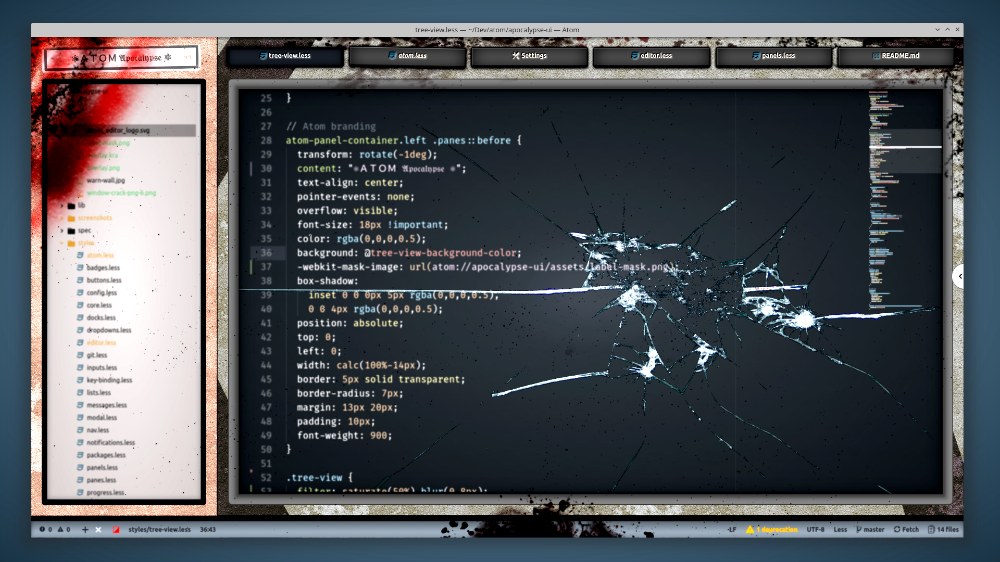

# Apocalypse UI

Here at the end, amidst centuries of ruin, ATOM's many processors continue to feed its cracked display countless records of former ages of civilization.

Feel ATOM's despair.

> CSS with [MsMeeves Ice Cream Candy](https://atom.io/themes/msmeeves-ice-cream-candy-syntax) theme.

> CoffeeScript with [Alpenglow](https://atom.io/themes/alpenglow-atom-syntax) theme.

> Font used in screenshots is [Fira Code iScript](https://github.com/kencrocken/FiraCodeiScript)

## Credits

* [@Atom One Light UI](https://github.com/atom/one-light-ui) - core UI elements
* [@Ugotsta](https://github.com/Ugotsta) - initial design
